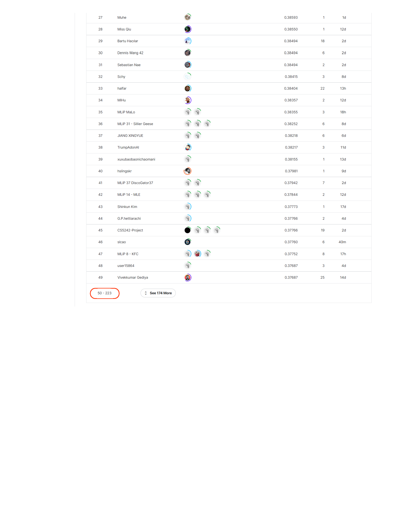

# PlantTraits-ensemble

This is the implementation of the VIT-MHA ensemble model participating the PlantTraits2024 Challenge. We ranked top 10% in Kaggle Leaderboard by the time of submission.

The model architecture is as follow.

The [PlantTraits2024 Challenge](https://www.kaggle.com/competitions/planttraits2024/overview) is organized by CVPR 2024
that allows us to apply machine learning techniques to environmental
science field. This competition is situated within
the Fine-Grained Visual Categorization FGVC11 workshop
at CVPR 2024. The task of this challenge is to predict
six important plant traits using a dataset of crowd-sourced
plant images coupled with auxiliary data. This competition
launched on February 1st, 2024 and will conclude on June
2nd, 2024.